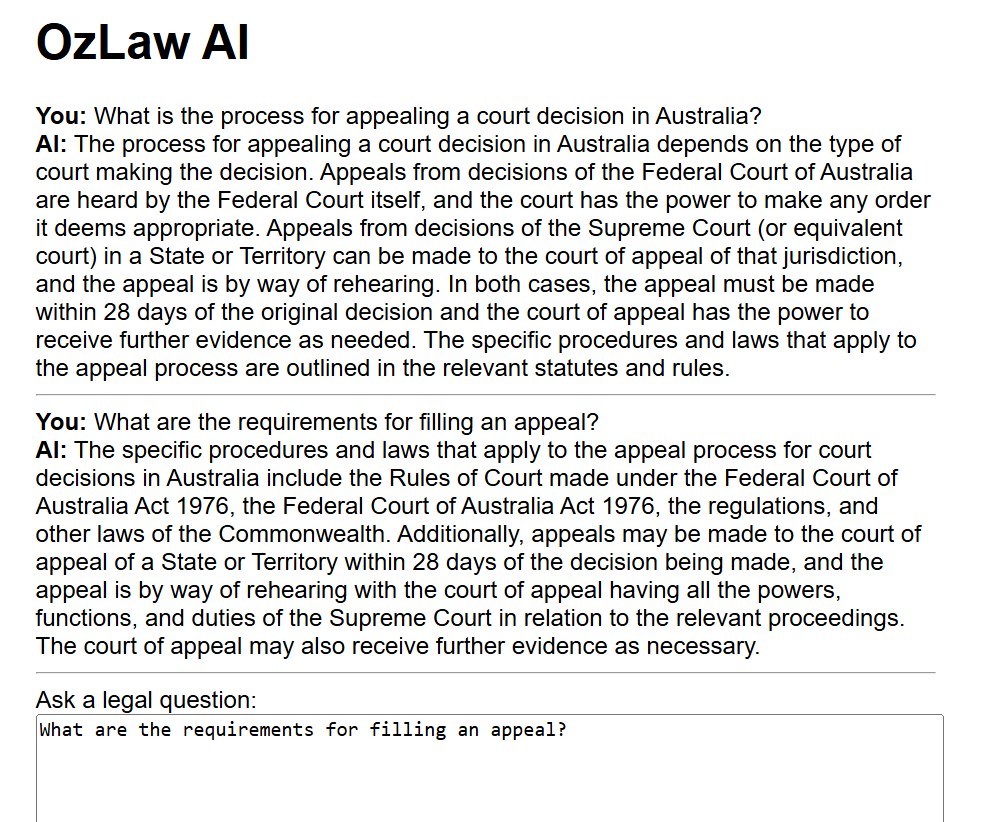

# ⚖️ OzLaw AI: AI-Powered Australian Legal Assistant



> _Bridging the Gap Between Australians and Legal Access_

**OzLaw AI** is a free, open-source, people-centric initiative designed to make Australian legal guidance accessible to everyone. Using **AI-powered Retriever-Augmented Generation (RAG)**, OzLaw AI delivers quick, accurate legal support tailored to your needs—whether you’re a layperson or a professional.

> 🛡️ **Mission:** “Justice should be accessible to everyone. OzLaw AI ensures that no one is left behind when it comes to legal knowledge.”

---

## 📚 Legal Coverage

OzLaw AI currently supports the following Australian laws (with plans to expand):

- 📜 **Criminal Code Act 1995**
- 📦 **Competition and Consumer Act 2010**

---

## 💻 Developer Quick Start Guide

Ready to get started? Follow these simple steps to set up **OzLaw AI** on your machine:

1. **Clone the Repository**  
   ```sh
   git clone https://github.com/yourusername/ozlaw-ai.git
   cd ozlaw-ai
   ```

2. **Install Dependencies**  
   ```sh
   pip install -r requirements.txt
   ```

3. **Set Your OpenAI API Key**  
   Create a `.env` file in the project root and add:
   ```
   OPENAI_API_KEY=your-api-key-here
   ```

4. **Prepare Legal Documents**  
   Place your legal documents in the `data/` directory. Use the provided scripts to process and embed documents.

5. **Run Database Migrations**  
   ```sh
   cd backend
   python manage.py migrate
   ```

6. **Start the Application**  
   ```sh
   python manage.py runserver
   ```
   Then open your browser and visit:  
   [http://127.0.0.1:8000/](http://127.0.0.1:8000/)

---

## 🔧 Tools & Technologies

| 💡 **Technology**      | 🔍 **Description**                              |
|-----------------------|-------------------------------------------------|
| **Django**            | High-level Python web framework for robust apps |
| **LangChain**         | Framework for building language model pipelines |
| **ChromaDB**          | Vector database for RAG implementation          |
| **OpenAI API**        | Powering natural language understanding         |

---

## 🚀 Features

- Conversational legal Q&A with context memory
- RAG pipeline for accurate, document-grounded answers
- ChromaDB vector storage for fast retrieval
- Simple, user-friendly web interface
- Easy document ingestion and processing
- Open source and extensible

---

## 🛠️ CI/CD

OzLaw AI uses GitHub Actions for CI/CD.  
- On every push to data, ingestion scripts, or requirements, the pipeline:
  - Installs dependencies
  - Ingests legal documents
  - Runs RAG pipeline tests
  - Runs Django system checks

---

## 🌟 Future Roadmap

- 🤝 Multi-agent legal reasoning
- 🌎 Expansion to other common law jurisdictions
- 🗣️ Voice interaction
- 🌍 Multi-lingual legal assistance
- 🎯 Advanced search & tailored legal help
- ✍️ Legal document generation
- 🗓️ Case management features

---

## 🤝 Contribute

We welcome contributors! Whether you want to help with development, report issues, or request features, fork the repo and submit a pull request. Every contribution helps make **OzLaw AI** better for everyone.

---

**OzLaw AI** is more than just an AI tool—it's a movement to democratize access to legal knowledge for all Australians.  
Together, let’s make justice truly accessible! ✨

---

## License

[Apache-2.0 License](LICENSE)

---

**Inspired by [LawGlance](https://github.com/lawglance/lawglance) – thank you to the open source legal AI community!** 